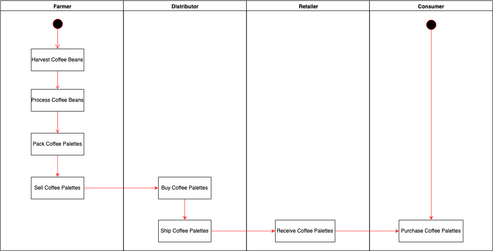
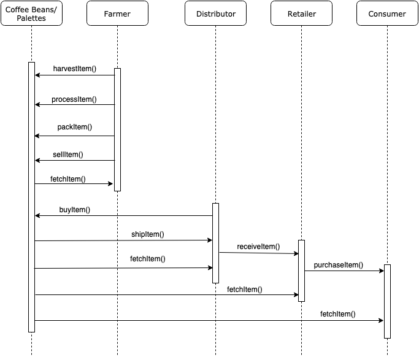
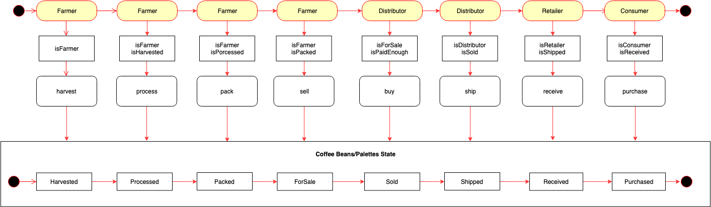
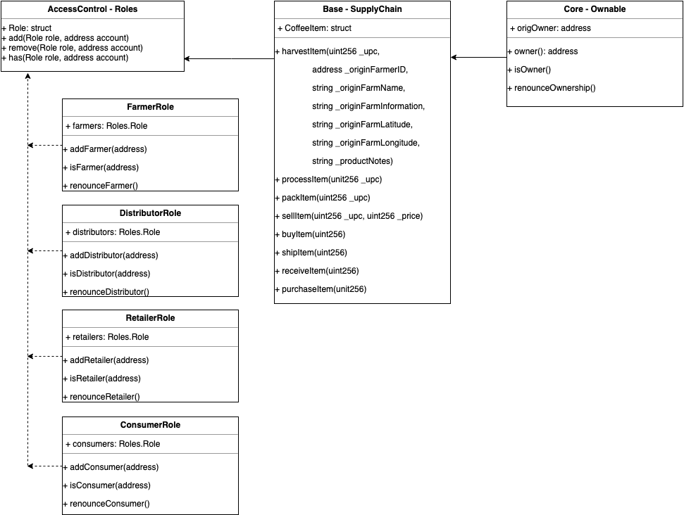

# Blockchain Developer Nanodegree Term 2

# Architect a Blockchain Supply Chain Solution - Part B

I implemented a supply chain Blockchain solution for the [Blockchain Developer Nanodegree Program Term 2 Project 6](https://classroom.udacity.com/nanodegrees/nd1309/parts/8ccccdaa-79a3-443a-a03f-00cacd0277b7/modules/47d6cc21-fafe-406e-8370-e5ba23875da8/lessons/da5331bc-e6ae-4372-b18a-71fa7cc77b67/project).

## The design UML diagrams of this solution 
### Activity Diagram


### Sequence Diagram


### State Diagram


### Class Diagram


## The implementation has the following subcontracts inheritance structure: 
```
contract AccessControl
contract Base is AccessControl
contract Core is Base
```
### AccessControl - Collection of Contracts: 
These contracts manage the various addresses and constraints for operations that can be executed only by specific roles.

There are 4 actors in a coffee supply chain:

- Farmer: The Farmer can harvest coffee beans, process coffee beans, pack coffee palettes, add coffee palettes, ship coffee palettes, and track authenticity.
- Distributor: The Distributor can buy coffee palettes and track authenticity.
- Retailer: The Retailer can receive coffee palettes and track authenticity.
- Consumer: The consumer can buy coffee palettes and track authenticity.

### Base - SupplyChain.sol: 
Tis defines the most fundamental code shared throughout the core functionality. This includes the main data storage, constants and data types, plus internal functions for managing these items.

### Core - Ownable.sol: 
It is the contract that controls ownership and transfer of ownership.

## Steps to run this project in development environment

Clone this repository:

```
git clone https://github.com/margaretycf/nd1309-Project-6b-Blockchain-Supply-Chain-Solution
```

### Launch Ganache locally
```
ganache-cli -m "panic vapor cigar advance occur protect pipe know merry clock when gown"
```

In a separate terminal window, Compile smart contracts:
```
truffle compile
```

Migrate smart contracts to the locally running blockchain, ganache-cli:
```
truffle migrate
```

Test smart contracts:
```
truffle test
```
All 10 tests should pass.

### Migrate to Rinkeby Network
```
truffle migrate --reset --network rinkeby
```

### Launch DApp
In a separate terminal window, launch the DApp:
```
npm run dev
```

Then run the DApp in browser - http://localhost:3000/

### Prerequisites

Please make sure you've already installed ganache-cli, Truffle and enabled MetaMask extension in your browser.

## Project Results

### Deployed Contract Address:
https://rinkeby.etherscan.io/address/0xec96e53ad9afac5c771c2a581c8317220a50ec1b

### Transaction History
- Harvested - 0x071fb8f5ec2e30e67c7362d3844362ef396c5563a210e3257100ee8f934138eb
- Processed - 0x6791645e949a4fcb3c46cd057665d72cd6d4bf4aa1337b8eaa7f0937b08b335e
- Packed - 0xde3c2581a43d180c63a017c260dc40e2a0ccbe022967a9520bda50a9969f3d8d
- ForSale - 0x279f4ab4ef86bfd838a404226668a5f8bc061a0b94c1f9c3042c6f36919ebb5a
- Sold - 0xe3213aad629f1578f311f3b4c7a500bbefe1f4dee2505bebc5b678f28e709982
- Shipped - 0x2fd3b8568ae9ce70655d6cbc9a31ae800aa9af50e68eac0eb7b09b2ca8b5c92d
- Received - 0xda86613223fcc26f719132145a5f41843f2a274ef079b32546df0c670ffdec60
- Purchased - 0xd69690c84594571102b2a3c7b44baf35914b36e02be08d8573307fca4a11f7eb